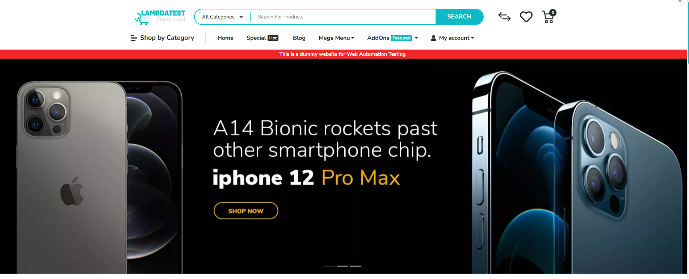
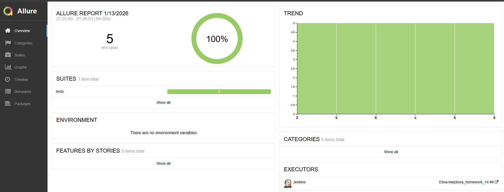
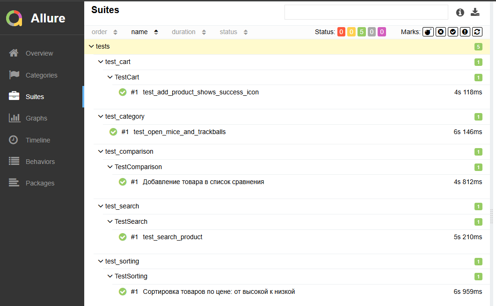
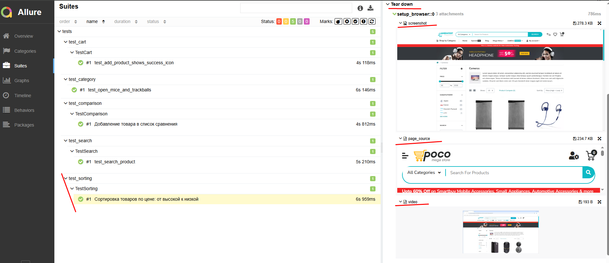
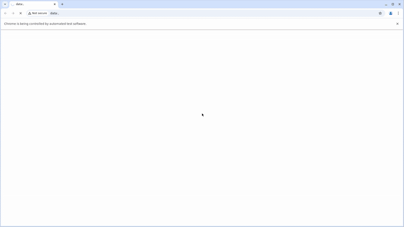
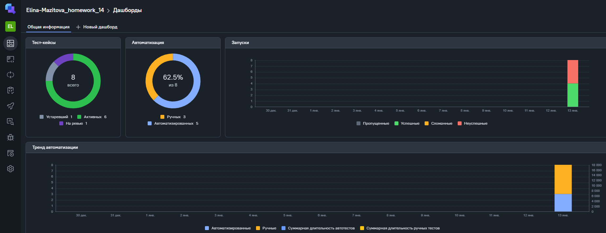
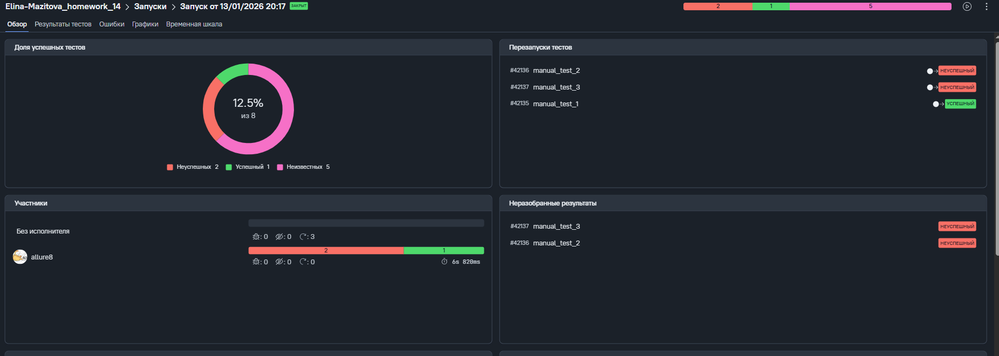
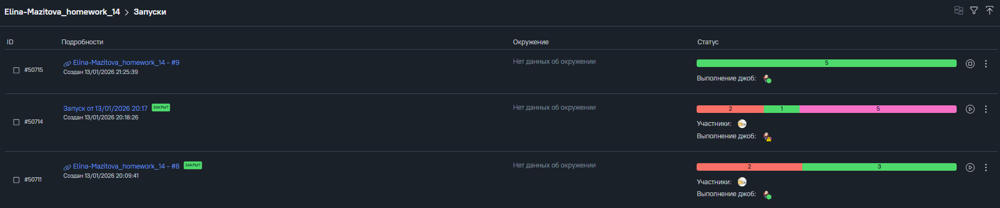
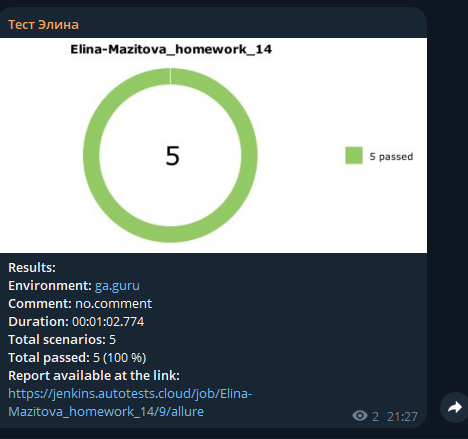

# 🧪 UI Test Automation Project

Автоматизация **UI-автотестов** для сайта **Ecommerce Playground**.  


---

## 📑 Содержание

- [🛠 Стек технологий](#-стек-технологий)
- [🔗 Полезные ссылки](#-полезные-ссылки)
- [📁 Структура проекта](#-структура-проекта)
- [🧩 Реализованные тесты](#-реализованные-тесты)
  - [🛒 Cart (test_cart.py)](#-cart-test_cartpy)
  - [🖱 Home / Categories (test_home.py)](#-home--categories-test_homepy)
  - [⚖ Comparison (test_comparison.py)](#-comparison-test_comparisonpy)
  - [🔍 Search (test_search.py)](#-search-test_searchpy)
  - [🔢 Sorting (test_sorting.py)](#-sorting-test_sortingpy)
- [▶️ Запуск](#️-запуск)
  - [Установка зависимостей](#установка-зависимостей)
  - [Запуск тестов](#запуск-тестов)
  - [Запуск с генерацией Allure-результатов](#запуск-с-генерацией-allure-результатов)
- [🖥 Запуск в Selenoid](#-запуск-в-selenoid)
- [⚙️ CI/CD в Jenkins](#️-cicd-в-jenkins)
  - [Артефакты Jenkins (скриншоты)](#артефакты-jenkins-скриншоты)
- [📊 Allure Report](#-allure-report)
  - [Разделы отчёта (скриншоты)](#разделы-отчёта-скриншоты)
- [🧭 Интеграция с Allure TestOps](#-интеграция-с-allure-testops)
- [📬 Telegram-уведомления](#-telegram-уведомления)
  - [Пример уведомления (скриншот)](#пример-уведомления-скриншот)


---
## 🛠 Стек технологий

| Технология | Описание |
|-----------|----------|
| | язык разработки |
|  | тестовый фреймворк |
|  | обёртка над Selenium |
|  | драйвер для автоматизации браузера |
|  | отчёты о тестировании |
|  | управление тестами |
|  | удалённый запуск браузеров |
| | CI/CD |
|  | уведомления о сборках |

---

## 🧩 Реализованные тесты

### 🛒 Cart (test_cart.py)
**Цель:** Проверка добавления товара в корзину.

### 🖱 Home / Categories (test_home.py)
**Цель:** Проверка открытия категории товаров.

### ⚖ Comparison (test_comparison.py)
**Цель:** Проверка добавления товара в список сравнения.

### 🔍 Search (test_search.py)
**Цель:** Проверка поиска товара.

### 🔢 Sorting (test_sorting.py)
**Цель:** Проверка сортировки товаров по цене (от высокой к низкой).

---

## ▶️ Запуск

### Установка зависимостей
```bash
pip install -r requirements.txt
```
### Запуск тестов
```bash
pytest
```
### Запуск с генерацией Allure-результатов
```bash
pytest --alluredir=allure-results
```
## 🖥 Запуск в Selenoid
Основные настройки указаны в conftest.py:
```bash
browserName: chrome
enableVNC: true
enableVideo: true
```
Видео и скриншоты автоматически прикрепляются к отчёту Allure.

## ⚙️ CI/CD в Jenkins
Jenkins job выполняет следующие шаги:

1. Клонирование репозитория  
2. Установка зависимостей  
3. Запуск UI-тестов в **Selenoid**  
4. Генерация **Allure Report**  
5. Отправка результатов в **Allure TestOps**  
6. Отправка уведомления в **Telegram**  

## 📊 Allure Report

Отчёт Allure содержит:

- пошаговое выполнение тестов  
- скриншоты  
- HTML-снимки DOM  
- видео прохождения тестов  
- логи браузера  

### Разделы отчёта (скриншоты)

### 📊 Allure Report

- Overview


- Suites



- Attachments


- Video  
  
  
## 🧭 Интеграция с Allure TestOps

В рамках проекта настроено:
- Проект в Allure TestOps


- Загрузка результатов тестов из Jenkins


- Аналитика и история запусков


---
## 📬 Telegram-уведомления

После завершения сборки Jenkins отправляет уведомление в Telegram, содержащее:

- окружение сборки  
- количество выполненных и пройденных тестов  
- ссылку на **Allure Report**  

### Пример уведомления (скриншот)

- Telegram message  
  
